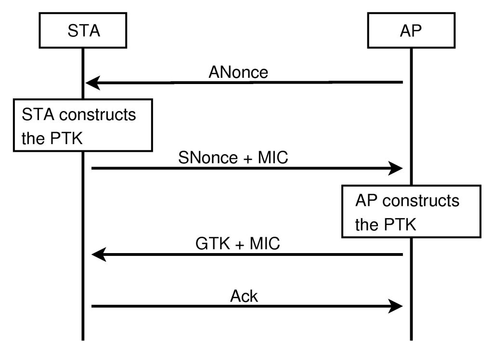
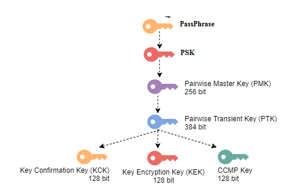

## Abstract
To connect to a WiFi network, the authentication depends on security protocols, the most common of which are: 
1. **WEP**
2. **WPA Personal**
3. **WPA Entreprise**
4. **WPA2-Personal**
5. **WPA2-Enterprise**
6. **WPA3**  

> There are 2 different versions of WPA and WPA2 which work slightly differently in terms of authentication.

While WEP and WPA3 have their own authentication protocols, WPA and WPA (the most common ones nowadays) use the **4-Way Handshake** method to allow a device to connect to WiFi and secure connection.

The 4-Way Handshake requires a PMK (Pair Master Key), a secret shared by both sides (client and server).
This can be a password (network key) or a username + password in the case of Enterprise authentication.

In this article, you will learn how this method works from a network-oriented point of view.

## Configuration
We will consider a WPA-Personal/WPA2-Personal WiFi, so the PMK will just be the WiFi password encrypted. We will dive in further explanations shortly.  

But remember that except getting PMK before authentication starts threw a WiFi password(secret shared by both sides), WPA2-Entreprise and WPA-Entreprise works the same way.
They use an external RADIUS authentication server with personal user informations and not a global shared key.
Indeed, they use 4-way handshake to secure communication.  

Lets consider the following situation:

There is a device that knows the key (password) and wants to connect to a WPA/WPA2-PSK WiFi network.

## 4-Way Handshake Initiation

The device sends an authentication request to the network.
**This request is not included in the 4-Way Handshake.**

## 4-Way Handshake

This diagram shows the different requests and what they contain.

> Note: *"STA" stands for Station, and "AP" for Access Point*  
> The device is actually the station and the access point is the network node handling authentication

## First Request
Firstly, the AP sends a nonce, which is a large random integer.

When the station receives the packet, the station creates the PTK (Pairwise Transient Key) using the Key Derivation Function (KDF).
This key is created with:
1. The Pre-Shared Key (PSK),
2. The ANonce received previously,
3. The SNonce.

The SNonce is similar to the ANonce, a large random number generated on the station side.
Each time the station tries to authenticate, the SNonce and ANonce are generated again.
These numbers ensure that the PTK is temporary.

The KDF algorithm returns the PTK.
We don’t use the password or the PSK directly because we don’t want the explicit key to go through the network.
This is quite obvious; we don’t want others to easily intercept the password.

### Pre-Shared Key (PSK)
To get the PSK, the device only needs the SSID (network MAC address) and the password.  
=> The process is really simple:  
**Hash the password with the SSID as salt using the SHA-1 algorithm.**

Now, we have the PSK (the AP also performs this operation).

**The PSK is calculated before authentication starts (the station has all infos it needs).**  
**The PMK is exactly the same as PSK for both WPA-Personal and WPA2-Personal**

**VERY IMPORTANT**

*For WPA-Entreprise and WPA2-Entreprise, they use here the PMK created by RADIUS authentication*

## Second Request
Let’s make a short recap.  
At the beginning, we only know the **PSK=PMK**, which we derive from the **network password** and **SSID**.  
*PMK is derived from RADIUS authentication in case of WPA-Entreprise and WPA2-Entreprise*  

We received the AP's nonce from the first request, and the station generated the SNonce to create the **PTK** from the **ANonce**, **SNonce**, and **PSK**.

Now we need to tell the AP that we know the password without explicitly sending the password.

The station sends a packet containing the SNonce, allowing the AP to generate the same PTK.
At the end of the packet, a **signature called the Message Integrity Code (MIC)** is added.
  
The MIC is just a SHA-1 hash of the packet content with the PTK as salt.  
When the AP receives the second request, it will generate its PTK (it has all the necessary information: SNonce, ANonce, PSK).
However, at this moment, the AP doesn't know if the station has the correct password.

The AP generates the MIC from its newly generated PTK and compares it with the provided MIC.  
**If the MICs are identical => PTKs are identical => PSKs are identical => passwords are identical**

## Third Request
To tell the station that it has the correct password, the AP won't do so explicitly.  
**The AP will use the same strategy: a MIC.**

To optimize the request, the AP will send useful information: the Group Temporal Key (GTK), directly generated by the AP.

To check if the station has the correct password, the AP generates the MIC corresponding to the GTK (packet content) using the PTK.

If both match, the station and AP are sure that the other has the correct password.

## Last Request
The station sends an acknowledgment packet to tell the AP that everything is OK.

**The encrypted communication can now begin.**

## Encryption
WPA2 uses **AES** while WPA uses **TKIP** to encrypt packet content.
Even if both are encryption's methods, AES is more secure.
This makes it impossible for an hacker to read a captured packet.

The PTK contains several keys.  
Several keys are derived from the PTK:
1. **KCK** = PTK bits 0-127, the key confirmation key -> used for MIC (verifying message integrity).
2. **KEK** = PTK bits 128-255, the key encryption key -> used for encrypting the key data in the authentication packets.
3. **TEK** = PTK bits 256-383, the temporal encryption key for unicast traffic -> used for AES encryption.

We simplify things by saying that we use the PTK for something, but in reality, we often use just a part of it.

## Recap of Key Derivation

In WPA2-PSK and WPA-PSK, the PMK is the same as the PSK.

## Conclusion
Remember that even if we use WPA/WPA2, if a hacker catch all packets, he can brutforce PTK and get WiFi.
Indeed, he has all infos he needs (both nonces, BSSID, protocols...).

You learned how the 4-way handshake works.
Now you can discover the way to get PMK for WPA(2)-Entreprise.
