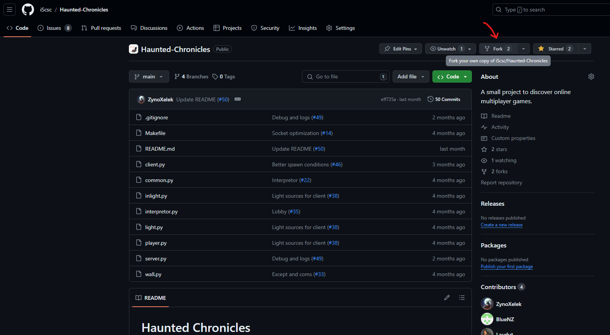
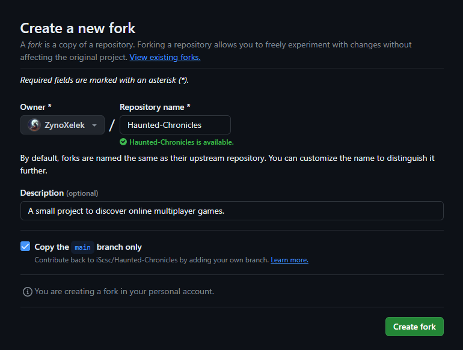
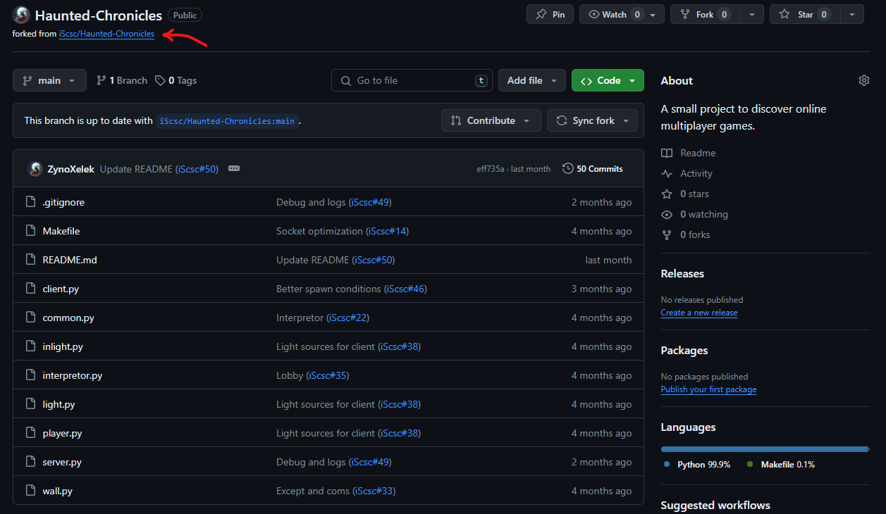
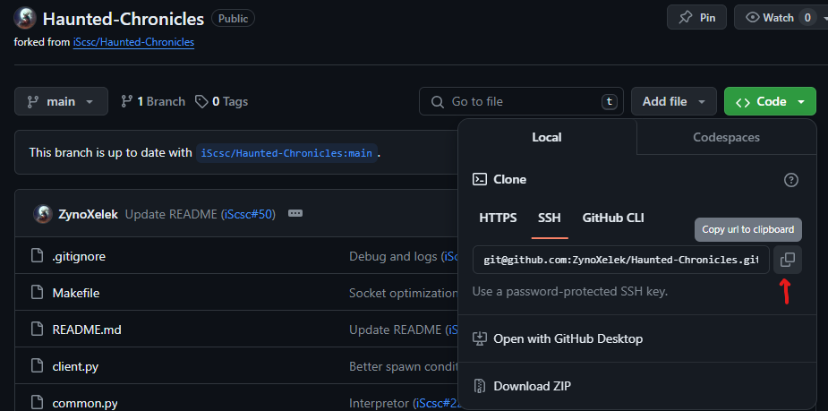
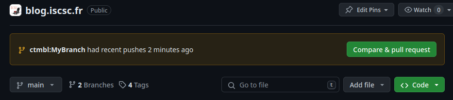
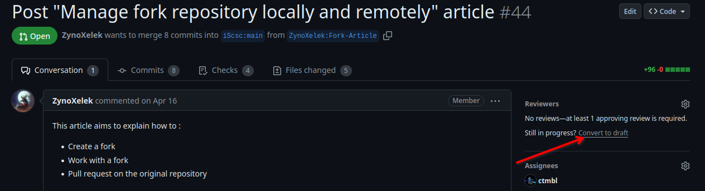
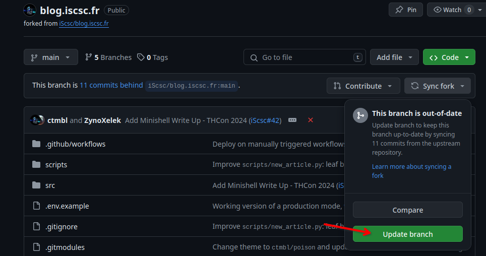

## What are forks ?

### A quick explanation

To make it simple, forks are copies of a repository you want to work on. This way, you can work on your version of the repository, create branches, experiment stuff, commit and pull request.

On many repositories you will not have the write access. Yet, you can still propose changes by forking the repository, working on it, and when finished, pull requesting the original repository you made the fork from.

### How to make one

To make a fork of a repository you want to work on, simply go on the github repository page, and press the designated button!

For instance, if you want to propose changes for our game [**Haunted Chronicles**](https://github.com/iScsc/Haunted-Chronicles), you can do it this way:



GitHub will ask you to name the fork repository but it have no importance, you can keep the original name.



When it's done, you will have created a new repository on your own GitHub account:



We can see the original repository it has been forked from, and you can quickly access it through this link.

## Working with forks

Now that you have created your own fork, you simply have to experiment on your fork!

First, clone your fork on your computer with the link of your repository.

```
git clone <link_to_your_fork>
```

In this example, `<link_to_your_fork>` would be `git@github.com:ZynoXelek/Haunted-Chronicles.git`:


> Using the SSH protocol first requires to have set up your SSH key with your github account. If you have not done it yet, you should probably read [Github - Create a SSH key](https://docs.github.com/en/authentication/connecting-to-github-with-ssh/generating-a-new-ssh-key-and-adding-it-to-the-ssh-agent) and [GitHub - Add a new SSH key](https://docs.github.com/en/authentication/connecting-to-github-with-ssh/adding-a-new-ssh-key-to-your-github-account) first.

Then, you can create a new branch by using the command :
```
git branch <your_branch_name>
```

You can then place your git `HEAD` on this new branch by using the command :
```
git checkout <your_branch_name>
```

When this is done, you can start working on your code!

Once you have finished your work - or your session - don't forget to commit your changes after adding your new changes! To do so, first check the differences between your local repository and the remote one with `git status` and `git diff`

Then, you can selectively chose which files you want to add to your commit with `git add <file1> <file2> ...` or you can add them all with `git add .` (but you shouldn't, this is really bad practice).

If you have made a mistake, you can revert a `git add` by using `git reset <file1> <file2> ...` or `git reset` to unstage them all. This will keep your local changes.

Don't hesitate to use `git status` between each command to clearly see the actual state of your changes. You can also use the magic command `git log --graph --oneline --all --decorate` to see the actual state of your local and distant repositories in the nicest way!

Be careful, `git rm <file>` exists but it will permanently remove the file from the repository!

When you have finished staging all your changes, you can commit by using the `commit` command:
```
git commit -m <your_commit_name>
```
> Note that commits are intended to be meaningful **little** piece of code, generally you should create several commits per Pull Request and **avoid** fat commits  
> As one says "commit early and commit often"

Note that this will just commit your changes on your local branch.
When you want to send these changes to the remote repository, you shall use the `push` command:
```
git push origin <your_branch>
```

> `git` commands are also integrated into some code editors such as `VS code`, but you should know that it may sometimes do some strange things, and using the terminal commands may make it easier to understand what really happens

## Pull requesting

When you have a first version of your code and you want to propose your changes to the origin repository, you will need to pull request.

To do so, you must first push your branch to the remote repository.  
When it is done, go on the origin repository GitHub page, and you will have the possibility to Pull Request your changes.


> You should see this banner on the GitHub page of your fork and the original repository, it doesn't matter

In fact, you should definitely Pull Request **before** finishing your code, and there is numerous reason to that.  
It helps with your work's transparency, but it also allows you to receive feedback sooner, which could prevent working several hours on something that is wrong from scratch. You will be able to change your code immediately and it could prevent a lot of frustration on your side.  
Similarly, when working on open source repositories, the owner have the complete right to refuse your change, even if you think your change is right and legitimate. Knowing that it will be refused whatsoever after working an hour on it is definitely easier to accept than after working weeks on your code.

And don't worry, you will be able to keep working on your code even after pull-requesting, just create other commits and push as we did before.

You could also mark your PR as a draft to tell your reviewers that you are still working on it by clicking there:



## Update your fork

Once your Pull Request have been accepted on the remote origin repository, you may update your fork to the new state of the origin repository.

To do so, you shall :

* 1 - Go on your fork page on github and press the "Update branch" button:  

* 2 - Then, to update your local copy, you should use these 3 commands:
  * 2.1 - `git fetch origin`: To download the remote state of the repository to your local github (you may now see it with the git log command we talked about above)
  * 2.2 - `git checkout main`: To put your git `HEAD` on your `main` branch
  * 2.3 - `git rebase origin/main`: To move your local main to remote reference you have just downloaded
