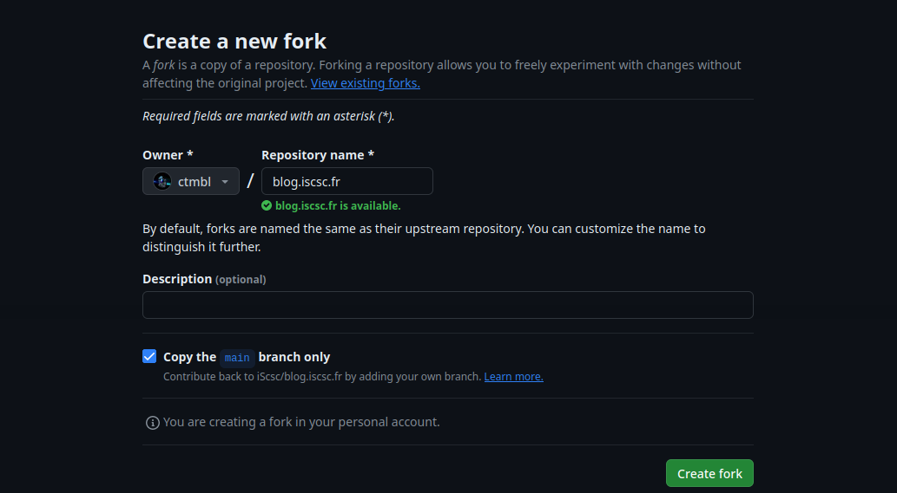
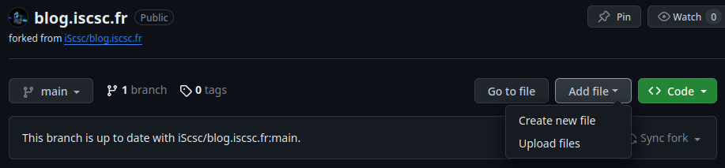
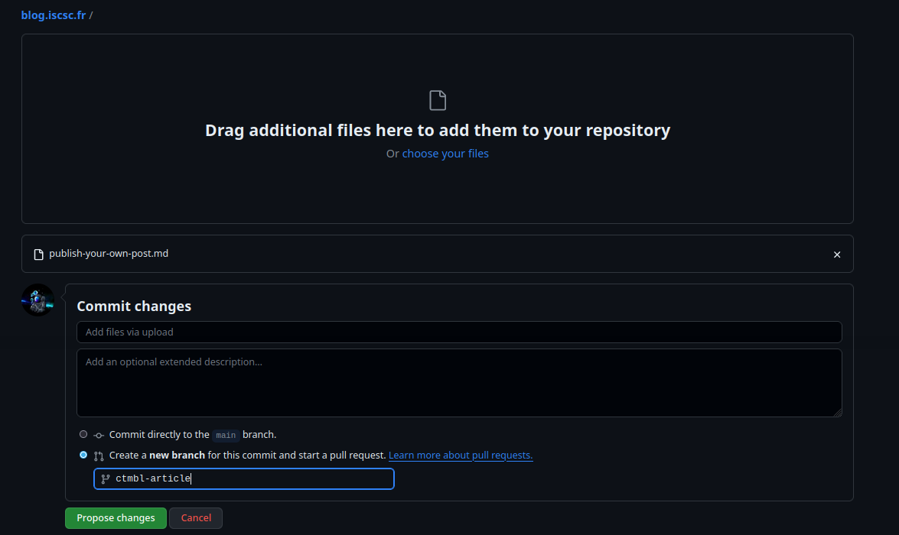
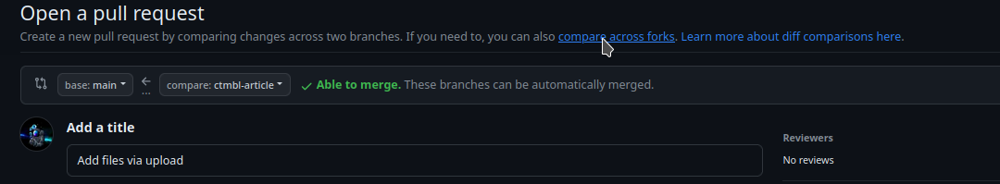
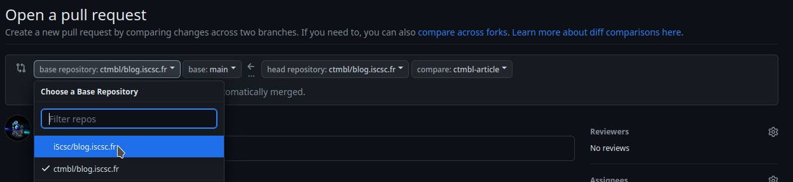
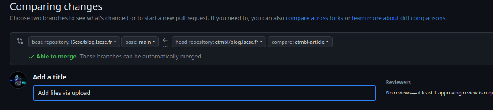
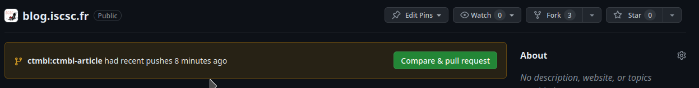
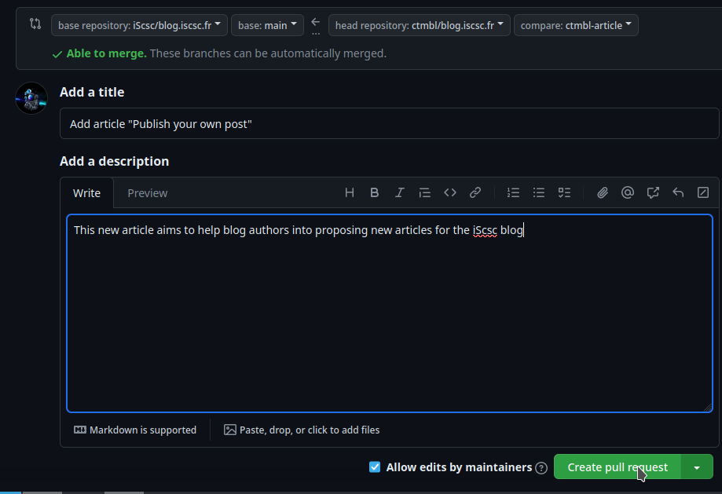

This blog aims to be open to everyone, not only iScsc members.  
Here is a little tutorial to show how to write and publish your own article :wink:

It is composed of 4 sections:
<!--more-->
- [1- Write your post in markdown](#1--write-your-post-in-markdown) (OPTIONAL)
- [2- Write the header](#2--write-the-header) (OPTIONAL)
- **[3- Publish your post!](#3--publish-your-post)**: the **MOST** important!
- [4- Review](#4--review): the conclusion


I **STRONGLY** recommend you to **read every NOTE** at each section's beginning, often it will save you valuable time :slight_smile:

Also as stated later, if you're struggling with something, you can contact me on Discord: `ctmbl` or open an [Issue](https://github.com/iScsc/blog.iscsc.fr/issues) on the GitHub repository.

## 1- Write your post in markdown
> **NOTE**: if you're already used to Markdown you can skip to section 2 :slight_smile:

Of course this is the first step, write an article in markdown format (the format used in GitHub, Discord,...): `.md`.  
Basically the only things you need to know are:
 - Huge titles with: `# My HUGE Title`, lesser big with `## Still big title`, and so one up to `###### really small title`
 - **bold** with `**bold**`, *italics* with `*italics*`
 - lists with 
```
My list:
 - blabla
 - blala 2
```
 - next paragraph by letting an **empty line**
 - [hyperlinks](https://developer.mozilla.org/en-US/docs/Learn/Common_questions/Web_mechanics/What_are_hyperlinks) with `[some blabla](http://blabla.com)`
 - inline `code` with \`inline code\`
 - code section with:  
```
`` `py  
import pwn   
   
\# python code you got it  
`` `
Note: remove the whitespace : `` ` -> ``` I wrote it that way because it would be
interpreted as code section otherwise...
```
An online markdown editor to get used to it: https://stackedit.io/  
There is also a VSCode extension to render markdown in VSCode: `Markdown All in One`.

## 2- Write the header
> **NOTE**: if this step bothers you, just go to the next one and we'll figure it out later during the review process

The header contains all the information about your post: author, title, summary, date,...  
It has basically this format:
```yml
---
title: "Publish your own post! (in Markdown)"
summary: "How to write, in markdown, and publish an article on the iScsc blog through GitHub's Pull Requests"
date: 2023-11-30T17:52:09-02:00
lastUpdate: 2023-11-30T17:52:09-02:00
tags: ["iscsc","blog","posts","markdown"]
author: ctmbl
draft: false
---
```
These are the mandatory information, please fill in with your information and place it at the very beginning of the file!

## 3- Publish your post!
You've reached it! The last and final step :slight_smile:

> **NOTE**: if you're struggling with GitHub: **don't** give up!  
> You can contact me on Discord: `ctmbl` or open an [Issue](https://github.com/iScsc/blog.iscsc.fr/issues) on the GitHub repository, I'll happily walk these steps with you!

### 3.1- GitHub Account
To publish your post you'll only need one thing: a [GitHub](https://github.com) account, you can create one.

### 3.2- Fork
Once you've created it:
- go to https://github.com/iScsc/blog.iscsc.fr click on `Fork` on the top-right corner
- you can let every option by default:  

- approve by clicking `Create fork`  


Congrats! you've created your own copy of the blog!

### 3.3- Upload and Branch
Now, you should be on `https://github.com/YOUR GITHUB USERNAME/blog.iscsc.fr`, go there if you're not and:
- click `Add file` then `Upload files`  


- then **drag** your new post in the box (or add it with `choose your files`)  

- select `Create a new branch...` (the name don't matter)
- click `Propose changes`

### 3.4- Pull Request
OK, let's wrap up a bit, here you should already have: 
- created your GitHub account
- created your fork
- uploaded your file (and thus created your branch)

Now let's create the associated **Pull Request** to finally share your article with the world!

#### 3.4.A- Create PR directly...
> **NOTE**: if you don't end up on the same webpage than me, skip this **subsection** and go to `OR from the repo's page` (3.4.B subsection).

> **NOTE 2**: if you're interested in why we're doing this, `git` mechanisms (branch, ...) and `GitHub` ones (repos, Pull Requests, Forks), I should right soon post an article on the [blog](https://iscsc.fr)

Now that your files are uploaded you should see:

- click `compare across forks` (under the cursor on the above screenshot)
- then change `base repository` and select `iScsc/blog.iscsc.fr`


Finally the head banner should look something like:



#### 3.4.B- OR from the repo's page
> **NOTE**: if you've done the **subsection** `Create PR directly...`'s steps, **skip** this one

- go to https://github.com/iScsc/blog.iscsc.fr you should see: 

- click `Compare & pull request`

### 3.5- Write a good Pull Request
The hardest part is done, now just fulfill the title and description of the Pull Request and click `Create Pull Request`


## 4- Review
You've done it!  
For now your part is done, now an admin/maintainer will review (read) your article to ensure everything is OK and will optionally suggest some changes (everything on the GitHub interface), so make sure to check your notifications: https://github.com/notifications, and your article will soon be available on our [blog](https://iscsc.fr)!
