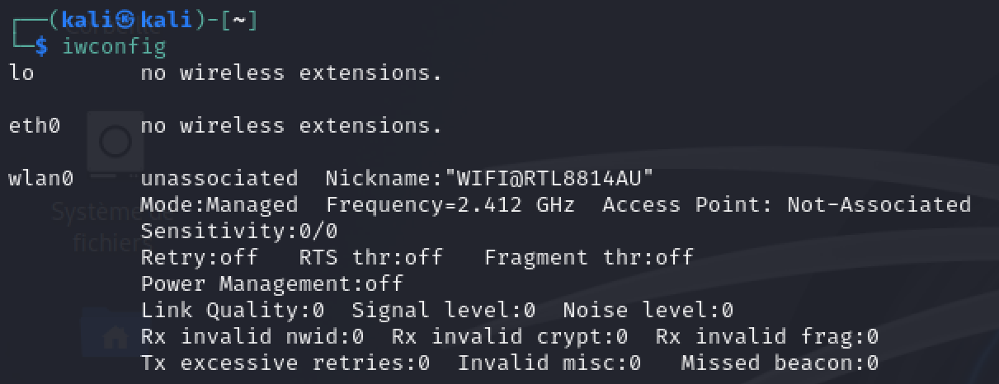
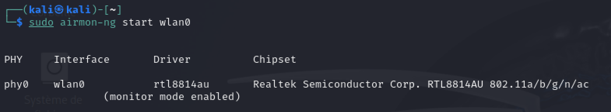
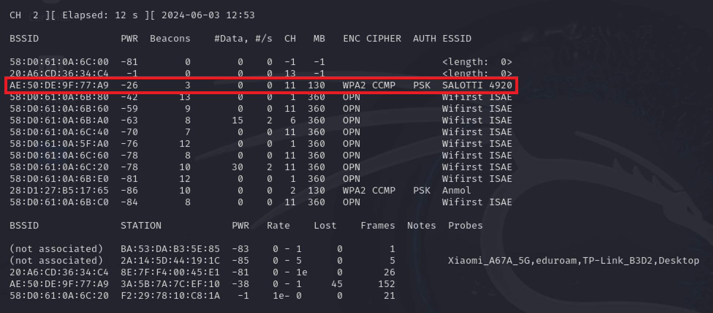
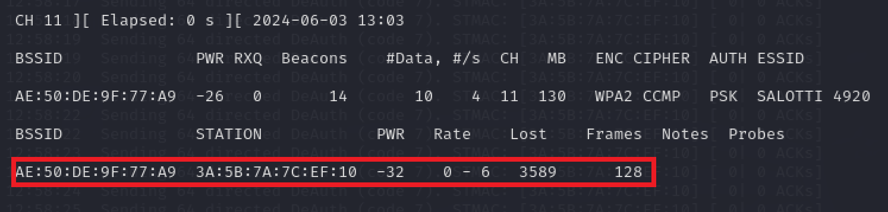
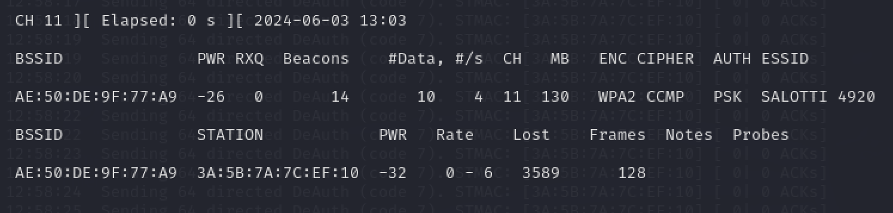
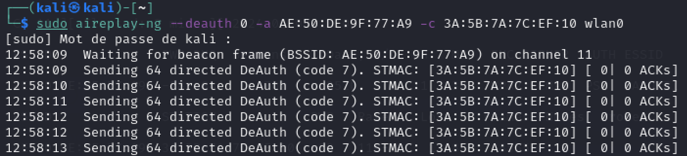

## Abstract

**Initial State:** A client is connected to a ***password-securised WiFi***

The goal is to get the WiFi password.  
To achieve this we must:  
1) Detect the target WiFi's signal
2) Detect connected computer to this WiFi
3) Send de-authentication packets to this computer to make it disconnect from the WiFi
4) Get the password "hash" when it tries to reconnect to WiFi
5) Bruteforce it :)

## Network Packet Structure


On each network packet there are source and destination addresses.
By default, WiFi cards only filter packet that have its IP as destination address.

That's a layer often added in driver, so it's hard to bypass.

> The first reason is not security though; it avoids useless CPU overhead and often, drivers on personal computers aren't made to allow monitor mode indeed

So how to bypass it ?

Buy a new WiFi Card with Monitor Mode capability that you can plug to your computer by USB (Monitor Mode is the ability to process all packets, even the ones that are not destinated to your MAC address).

I bought and used the AWUS1900.

The WiFi card will be considered as fully configured and driver installed in the rest of this tutorial.

To install the driver for AWUS1900 use:  
https://github.com/morrownr/8814au/blob/main/README.md

You will also have to install `aircrack-ng` on your machine.
For example on Ubuntu, Debian, or Kali:
```
sudo apt-get install aircrack-ng
```

## Step 1: Enable Monitor Mode
By default, your card is in Managed Mode (filter by destination address mode).
You have to tell him to get and read every packet.

First get your card interface name:
```
iwconfig
```



**Interface name is often wlan0 or wlan1**  
Then turn Monitor Mode on.  

```
sudo airmon-ng interface_name
```



> Note: Interface name can change to `<interface_name>mon`.
> You can check it with `iwconfig`.

## Step 2: Detect WiFi

```
sudo airodump-ng interface_name  
```


This will detect WiFi networks around. Each network is associated with a station address (the router).

Note the BSSID (MAC address of an access point) of the network you wish to target.
Note also the channel used, it represents the physical radio band on which the signal is actually modulated and sent.

> Note: For that concern, it is impossible to detect signals if the base frequency is not handled by your network card (2.4 Ghz only card and 5 GHz signal for instance)

## Step 3: Detect Computer Connectedfor

Then, we just add a filter to filter by source or destination equal access point MAC address
```
sudo airodump-ng -c channel --bssid mac_bssid
```



Here we can see connected computer(s)

Choose the one you want to hack and note the station MAC address.

## Step 4: Listen Network while Deauth Attack To Victim

We will now perform a de-authentication attack on the victim's station.
The goal is to make the station's WiFi Card disconnect and reconnect to network.
This will make the station send an authentication packet to the access point with the network password "hash" inside.
**That's the packet we wanna catch.**

We will do that with 2 commands:  
- Listen and write in a file all authentication packet catch threw this network.
```
sudo airodump-ng -c channel --bssid mac_bssid -w outfilename interface_name 
```



- Force the victim to de-authenticate from the WiFi.  
***We want to de-authenticate the victim while listening and writing network authentication packet when victim try to reconnect to his network => open a new terminal to perform attack***
```
sudo aireplay-ng -0 1 -a  mac_bssid -c station_mac_address interface_name
```



## Step 5: Checking EAPOL packet received

If de-authentication and re-authentication forced worked, we should have received an EAPOL packet. In listing packet terminal window, there's EAPOL written in packet received.


De-authentication works most of the time but immediate re-authentication doesn't always work.
Indeed, Mac OS does not reconnect immediatly to previously reconnected Network after WiFi card unplanned restart.
Windows OS doesn't follow the rule and try to reconnect instantly (prefer Windows station to attack if you have the choice :wink:)

Then, if it works stop the listening we have what we want by Ctrl+C over listening terminal.

## Step 6: Retreiving WiFi password

A new file was created, you can easily check it with the `ls` command.

### Time to bruteforce
To bruteforce we can choose different techniques, in our case we will perform a dictionary attack.
`rockyou.txt` is a good dictionary by default (you can find it [here](https://github.com/zacheller/rockyou)).

```
sudo aircrack-ng -w rockyou.txt outfile.cap
```


## Conclusion

The hardest thing to do is to force victim to reconnect.
Sometimes, victim OS does not reconnect automatically.  

Use strong passwords to protect your WiFi, and use the WPA3 protocol (hash function harder to calculate => lower hash rate).
It makes the bruteforce method less efficient.
